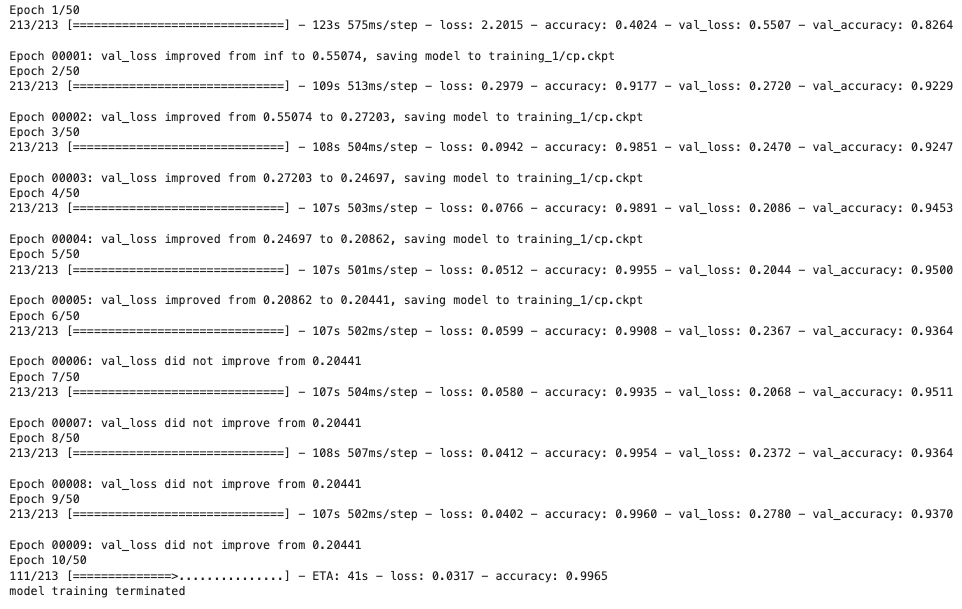

# ENEL 645 Group 21 & 22 Final Project: Novel CNN for Fish Classification (FishNet)

Dataset: https://www.kaggle.com/datasets/3edc5a44084ff30d4045620abd6fb7843bee344f3bc3a6c3e98f309e4e624657

Image data was aquired using the Kaggle API, the directory structure once downloading all data will need to be adjusted prior to training FishNet. 
The image data should replicate the following directory structure:

```
data
├── Model
├── fish_data
│   ├── Test
│   │   ├── Black Sea Sprat
│   │   ├── Gilt Head Bream
│   │   ├── Horse Mackerel
│   │   ├── Red Mullet
│   │   ├── Red Sea Bream
│   │   ├── Sea Bass
│   │   ├── Shrimp
│   │   ├── Striped Red Mullet
│   │   └── Trout
│   └── Train_Val
│       ├── Black Sea Sprat
│       ├── Gilt Head Bream
│       ├── Horse Mackerel
│       ├── Red Mullet
│       ├── Red Sea Bream
│       ├── Sea Bass
│       ├── Shrimp
│       ├── Striped Red Mullet
│       └── Trout
└── training_1
```
Within each of the fish species directories (e.g. "Black Sea Sprat"), inside both the `Test` and `Train_Val` directories, there will be two sub-directories "Black Sea Sprat" and "Black Sea Sprat GT". 
It is important to remove the ground truth image directory, then extract all images from "Black Sea Sprat" and place in the "Black Sea Sprat" **parent directory**, 
then it is recommended to delete the "Black Sea Sprat" **sub directory**.

Training was performed using an NVIDIA Tesla K80 GPU, it took approximately 45 minutes to reach optimum weights over 25/50 epochs. It is recommended to run `FishNet_TrainingOnly.py`, when training the model,
this script will train FishNet and save the best weights as a model checkpoint. `FishNet_ALL.ipynb` is also capable of training the model, however; it includes additional code related to visualization,
evaluation, and results summary. If `FishNet_ALL.ipynb` is run after `FishNet_TrainingOnly.py`, the model checkpoints will be loaded appropriately. The image belows displays the output of initiating a 
successful training job:


